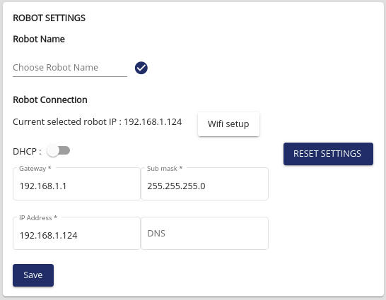

Find your Robot's IP address
=================================

In order to use your robot through TCP connection, you will first need
to connect to it, which implies that you know its IP address.

The next sections explain how to find your robot IP according to your configuration:

.. contents::
   :local:
   :depth: 1

Hotspot mode
----------------------------------------
If you are directly connected to your robot through its wi-fi, the IP address
you will need to use is ``10.10.10.10``.

Simulation or directly on the robot
----------------------------------------
In this situation, the robot is running on the same computer as the client,
the IP address will be the localhost address ``127.0.0.1``.

Direct ethernet connection
----------------------------------------
If you are directly connected to your robot with an ethernet cable, the static IP of your
robot will be ``169.254.200.200``.

The reader should note that he may need to change his wired settings to allow the connection.
See how to `Connect to Ned via Ethernet on Ubuntu <https://docs.niryo.com/applications/ned/source/tutorials/setup_connect_ned_ethernet.html>`_.

Computer and robot connected on the same router
-------------------------------------------------------------

You will need to find the robot's address using ``nmap``, or you can also use search button
of Niryo Studio to see which robots are available.

For example for our network configuration, we have:

.. code-block:: bash

    $ nmap -sP 192.168.1.0/24

    Starting Nmap 7.60 ( https://nmap.org ) at 2022-01-10 17:10 CET
    Nmap scan report for my_router.home (192.168.1.1)
    Host is up (0.010s latency).
    Nmap scan report for my_computer.home (192.168.1.10)
    Host is up (0.010s latency).
    Nmap scan report for niryo_pi4-11.home (192.168.1.107)
    Host is up (0.0034s latency).

In our case the ip of our robot is **192.168.1.107**.

You can also :ref:`source/setup/ip_address:Make IP permanent` so that
you will not have to search for it next time

Make IP permanent
-------------------

Go on NiryoStudio in the network configuration section.
For a dynamic IP address (recommended especially if you are a beginner), use the DHCP option.
You will find the new IP address of the robot by running a scan of the robots on the network on Niryo Studio.
Otherwise fill in the Gateway, Sub mask and IP address fields.

   Setting up a custom static IP on Niryo Studio

.. |link_ethernet| replace:: Connect to Ned via Ethernet on Ubuntu
.. _link_ethernet: https://docs.niryo.com/applications/ned/source/tutorials/setup_connect_ned_ethernet.html
