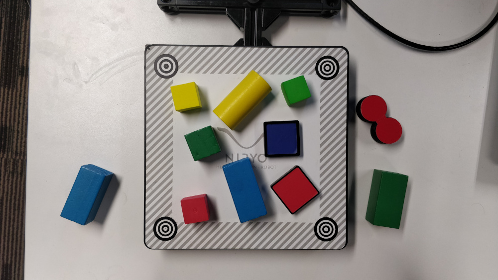

Overview
----------------------------------

This file illustrates few image processing pipeline using vision module from
niryo_edu package. This module is based in `OpenCV <https://opencv.org/>`_ and
its functions are detailed in :ref:`Functions documentation <vision-api>`.

| The package PyNiryo comes up with the **vision** module which contains
 image processing functions including thresholding, blob detection, ...
| You can import it using :python:`from pyniryo import vision`.

.. note::
    You can also import only the methods you want: :python:`from pyniryo import uncompress_image, undistort_image`.

Play with Robot video stream
-------------------------------------

Get & display image from stream
^^^^^^^^^^^^^^^^^^^^^^^^^^^^^^^^^^^^
Ned can share its video stream through TCP. As sending raw images will
lead to heavy packets which can saturate the network, it sends compressed images.
You access it through the robot's function:
:meth:`~pyniryo.api.tcp_client.NiryoRobot.get_img_compressed`.
Once your image is received, you firstly need to uncompress via
:meth:`~pyniryo.vision.image_functions.uncompress_image` and you can then display
it with :meth:`~pyniryo.vision.image_functions.show_img_and_wait_close`.

.. literalinclude:: code_snippets/get_display_img_from_stream.py
   :linenos:

.. note::
    :meth:`~pyniryo.vision.image_functions.show_img_and_wait_close` will wait for the user
    to press either *Q* or *Esc* key, before closing the window.

Undistort and display video stream
^^^^^^^^^^^^^^^^^^^^^^^^^^^^^^^^^^^^^^^^^^^^^^

.. note::
    Since the version 5.8.0 of the robot, you don't need to undistort the image beforehand.

In this section, we are going to display the raw video stream & the
undistorted video stream.

As Ned's camera is passing raw images to the robot, these
images are distorted due to the camera lens. In order to undistort them,
we need to use Ned's camera intrinsics.

To undistort the raw image, we use :meth:`~pyniryo.vision.image_functions.undistort_image`
which needs to be called with the parameters given by Ned through
:meth:`~pyniryo.api.tcp_client.NiryoRobot.get_camera_intrinsics`.

Once, we have both raw & undistorted images, we can concatenate them in order
to display them in once with :meth:`~pyniryo.vision.image_functions.concat_imgs`.
Finally, we display the image :meth:`~pyniryo.vision.image_functions.show_img`.

.. literalinclude:: code_snippets/undistort_and_display.py
   :linenos:

.. note:: To see more about camera distortion/undistortion,
    go on `OpenCV Documentation about Camera Calibration <https://docs.opencv.org/2.4/modules/calib3d/doc/camera_calibration_and_3d_reconstruction.html>`_.

Pure image processing functions
-------------------------------------

In order to illustrate functions, we are going to use the following image.

.. attention::
    In this section it is supposed that:

    * You have imported ``pyniryo.vision``
    * The variable ``img`` is containing the image on which image processing is applied

Color thresholding
^^^^^^^^^^^^^^^^^^^^^^^^^

Color thresholding is very useful in order to detect object with an uniform color.
The implemented function to realize this operation is
:meth:`~pyniryo.vision.image_functions.threshold_hsv`.

The following code is using parameters from :class:`~pyniryo.vision.enums.ColorHSV` enum
in order to threshold Red features & *hand made* parameters to extract Blue:

.. literalinclude:: code_snippets/color_thresholding.py
   :linenos:

.. list-table:: Images result
   :header-rows: 1
   :widths: auto
   :align: center

   *  -  Thresh color
      -  Image result
   *  -  Blue
      -  .. image:: images/img_threshold_blue.jpg
            :alt: Image Threshold Blue
   *  -  Red
      -  .. image:: images/img_threshold_red.jpg
            :alt: Image Threshold Red

Morphological transformations
^^^^^^^^^^^^^^^^^^^^^^^^^^^^^^^^

Morphological transformations are some simple operations based on the image shape. It is normally performed on binary images. It needs two inputs, one is our original image, second one is called structuring element or kernel which decides the nature of operation.
Two basic morphological operators are
`Erosion <https://en.wikipedia.org/wiki/Mathematical_morphology#Erosion>`_
and `Dilation <https://en.wikipedia.org/wiki/Mathematical_morphology#Dilation>`_.

Then its variant forms like
`Opening <https://en.wikipedia.org/wiki/Mathematical_morphology#Opening>`_,
`Closing <https://en.wikipedia.org/wiki/Mathematical_morphology#Closing>`_
also comes into play.
Learn more on `Wikipedia page <https://en.wikipedia.org/wiki/Mathematical_morphology>`_.

The implemented function to realize these operations is
:meth:`~pyniryo.vision.image_functions.morphological_transformations`.
It uses :class:`~pyniryo.vision.enums.MorphoType` and :class:`~pyniryo.vision.enums.KernelType`
to determine which operation should be applied on the image.

The code shows how to do a Closing & an Erosion:

.. literalinclude:: code_snippets/morphological_transformations.py
   :linenos:

.. list-table:: Images result
   :header-rows: 1
   :widths: auto
   :align: center

   *  -  Morpho type
      -  Image result
   *  -  None
      -  .. image:: images/img_threshold_any.jpg
            :alt: Image Threshold Any
   *  -  Erode
      -  .. image:: images/img_threshold_erode.jpg
            :alt: Image Erode
   *  -  Close
      -  .. image:: images/img_threshold_close.jpg
            :alt: Image Close

Contours finder
^^^^^^^^^^^^^^^^^^^^^^^^^^^^^^^^^^^^^^^^^
Contours can be explained simply as a curve joining all the continuous
points (along the boundary), having same color or intensity.
The contours are a useful tool for shape analysis and
object detection and recognition. See more on
`OpenCV Documentation <https://docs.opencv.org/3.4/d3/d05/tutorial_py_table_of_contents_contours.html>`_.

The implemented function to realize these operations is
:meth:`~pyniryo.vision.image_functions.biggest_contours_finder` which takes a
Black & White image, and extracts the biggest (in term of area) contours from it.

The code to extract and draw the 3 biggest contours from an image is
the following:

.. literalinclude:: code_snippets/contour_finder.py
   :linenos:

.. list-table:: Images result
   :widths: auto
   :align: center

   *  -  Thresh + Opening
      -  .. image:: images/img_threshold_any_open.jpg
            :alt: Image Threshold Any & Open
   *  -  3 contours
      -  .. image:: images/img_threshold_any_open_3_cnt.jpg
            :alt: 3 contours

Find object center position
^^^^^^^^^^^^^^^^^^^^^^^^^^^^^^^^^^^^^^^^^
In order to catch an object, we need to find a pose from where the
end effector can grasp the object. The following method
uses contours which have been found in the previous section and finds their
barycenter and orientation via the functions
:meth:`~pyniryo.vision.image_functions.get_contour_barycenter` &
:meth:`~pyniryo.vision.image_functions.get_contour_angle`.

.. literalinclude:: code_snippets/find_object_center_position.py
   :linenos:

.. list-table:: Images result
   :widths: auto
   :align: center

   *  -  Thresh + Opening
      -  .. image:: images/img_threshold_any_open.jpg
            :alt: Image Threshold Any & Open
   *  -  Barycenter + Angle
      -  .. image:: images/cnt_with_angle.jpg
            :alt: Barycenter + Angle

.. note::
    The drawn vector is normal to the contour's length because we want Ned
    to catch the object by the width rather than the length. Indeed, it leads to
    least cases where the gripper cannot open enough.

Markers extraction
^^^^^^^^^^^^^^^^^^^^^^
As image processing happens in a workspace, it is important to extract
the workspace beforehand! To do so, you can use the function
:meth:`~pyniryo.vision.image_functions.extract_img_workspace`.

.. literalinclude:: code_snippets/markers_extraction.py
   :linenos:

.. list-table:: Images result
   :widths: auto
   :align: center

   *  -  Original
      -  .. image:: images/img_illustration.jpg
            :alt: Original Image
   *  -  Extracted
      -  .. image:: images/workspace_extracted.jpg
            :alt: Extracted Image
            :height: 300px

Debug mode
^^^^^^^^^^^^^
If Ned's functions are failing, you can use Debug functions which are
:meth:`~pyniryo.vision.image_functions.debug_threshold_color` &
:meth:`~pyniryo.vision.image_functions.debug_markers` in order to display what
the robot sees.

You can use the functions as follow:

.. literalinclude:: code_snippets/debug_mode.py
   :linenos:

.. list-table:: Images result
   :widths: auto
   :align: center

   *  -  Original
      -  .. image:: images/img_illustration.jpg
            :alt: Original Image
   *  -  Debug red
      -  .. image:: images/debug_red.jpg
            :alt: Debug Red Image
            :height: 300px
   *  -  Debug Markers
      -  .. image:: images/debug_markers.jpg
            :alt: Debug Markers Image
            :height: 300px

Do your own image processing!
--------------------------------------

Now that you are a master in image processing, let's look at
full examples.

Display video stream with extracted workspace
^^^^^^^^^^^^^^^^^^^^^^^^^^^^^^^^^^^^^^^^^^^^^^^^^^^
In the current state, the following code will display the video stream
and the extracted workspace image. You can add your own image processing functions
maybe to apply additional process.

.. literalinclude:: code_snippets/display_stream_with_workspace.py
   :linenos:

Vision pick via your image processing pipeline
^^^^^^^^^^^^^^^^^^^^^^^^^^^^^^^^^^^^^^^^^^^^^^^^^^^

You may want to send coordinate to Ned in order to pick
the object of your choice! To do that, use the function
:meth:`~pyniryo.api.tcp_client.NiryoRobot.get_target_pose_from_rel` which
converts a relative pose in the workspace into a pose in the robot's world!

.. literalinclude:: code_snippets/vision_pick.py
   :linenos:
