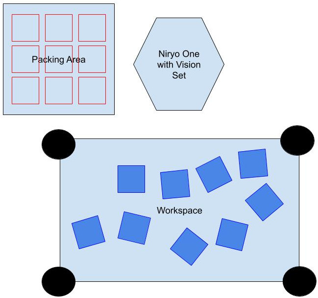
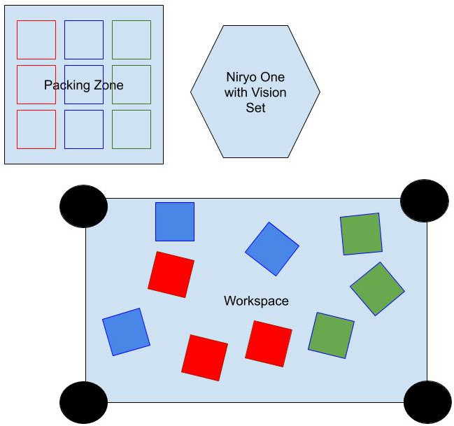
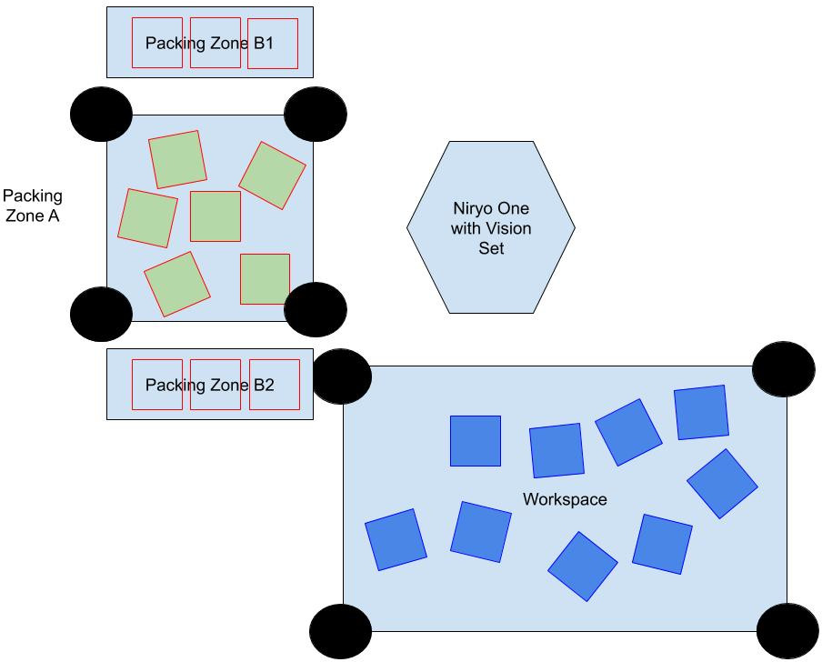
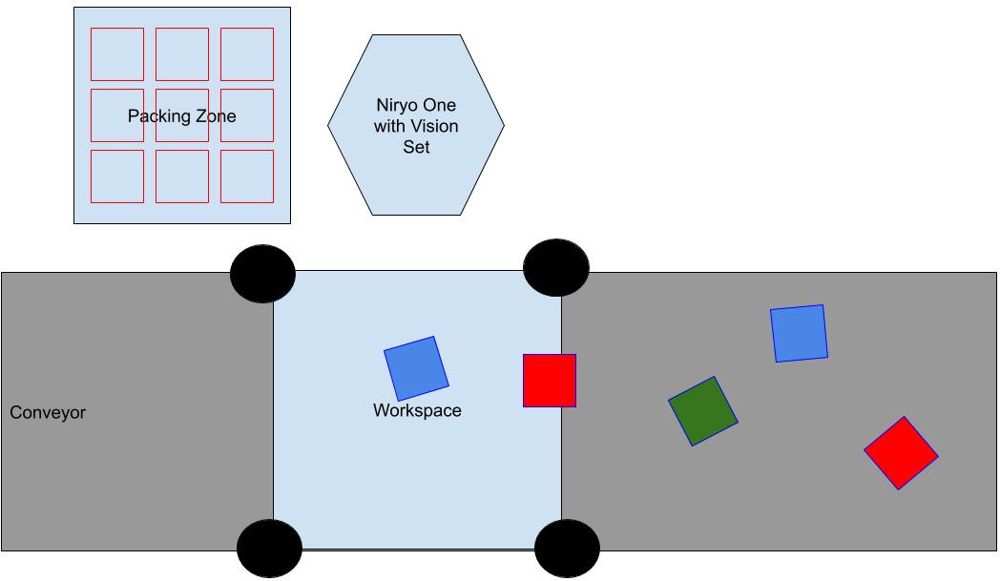

# PyNiryo - Vision Demonstrators

## What is on this folder ?

This folder contains some examples of industrial processes which can be realised with Ned.

Each one of these processes comes with :
* A illustration to recreate the process' disposition
* A Python script which will be run in order to execute the process. This Python script is well commented
so that, process can be understood, modified & retro-engineered

## Process 1 - Simple Reference Conditioning

This process consists in picking any type of object from the working area and to condition them in a packing area
in the form of a NxM rectangular grid

Illustration :

The code of the process can be access in the file : 
[1_simple_reference_conditioning.py](1_simple_reference_conditioning.py)

The boolean `vision_process_on_robot` indicate whereas the
image processing computation is made on the robot or not.
It is a good way to understand how to process image to detect object.

The user **has to** change these variables:
- robot_ip_address
- tool_used
- workspace_name

The user **can** change:
- grid_dimension
- vision_process_on_robot
- display_stream

The user **may** change these position:
- observation_pose
- center_conditioning_pose
- sleep_pose

## Process 2 - Multiple Reference Conditioning

This script shows an example of how to use Ned's vision to
make a conditioning according to the objects' color.

The objects will be conditioned in a grid of dimension grid_dimension. The Y axis corresponds
to the ObjectColor : BLUE / RED / GREEN. It will be 3
The X axis corresponds to how many objects can be put on the same line before increasing
the conditioning height.
Once a line is completed, objects will be pack over the lower level
Illustration :

The code of the process can be access in the file : 
[2_multiple_reference_conditioning.py](2_multiple_reference_conditioning.py)

The user **has to** change these variables:
- robot_ip_address
- tool_used
- workspace_name

The user **can** change:
- grid_dimension

The user **may** change these position:
- observation_pose
- center_conditioning_pose
- sleep_pose

## Process 3 - Conditioning and Packing with 2 Workspaces

This script shows an example of how to use Ned's vision with 2 
workspaces : 1 for picking & 1 for packing

The robot will firstly detect one pack place, then it will take one object
from the picking area. This object will be pack and then, the pack will be
place on the side of the working area
Illustration :

The code of the process can be access in the file : 
[3_conditioning_and_packing_2_workspaces.py](3_conditioning_and_packing_2_workspaces.py)

The user **has to** change these variables:
- robot_ip_address
- tool_used
- workspace1_name
- workspace2_name

The user **may** change these position:
- observation_pose
- center_conditioning_pose
- sleep_pose

## Process 4 - Conditioning with a conveyor

This script shows an example of how to use Ned's vision with a Conveyor Belt

At the beginning, the robot camera is placed is placed over the conveyor belt.
When it detects an object, it stops the conveyor, then, it realise a pick and place operation
as the one we have in the firs demonstrator
 

The code of the process can be access in the file : 
[4_conditionning_with_conveyor.py](4_conditionning_with_conveyor.py)

The user **has to** change these variables:
- robot_ip_address
- tool_used
- workspace_name

The user **can** change:
- grid_dimension
- vision_process_on_robot
- display_stream

The user **may** change these position:
- observation_pose
- center_conditioning_pose
- sleep_pose

